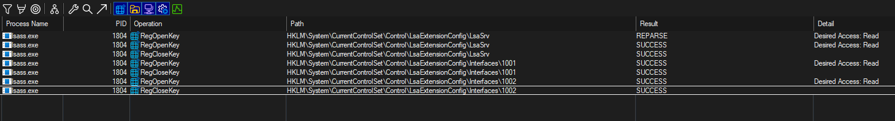
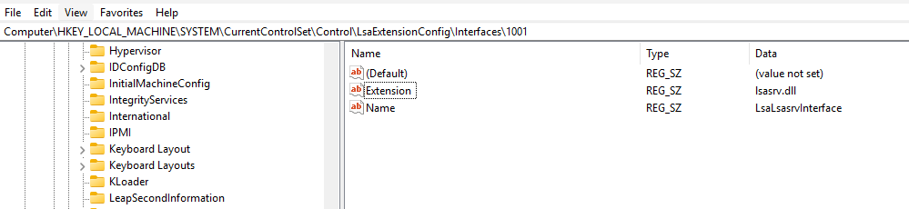
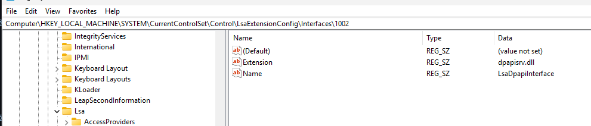

# LSASSHijack

用于持久化，在启动时将 DLL 加载到 LSASS 中。

> 注意！：PPL会阻止未签名的程序加载到 LSASS 中，这会导致卡死在启动这个过程不停重复，因为 LSASS 会在启动前崩溃（因为加载了未签名的 DLL），可以通过加载一个已签名但存在漏洞的 DLL 。


# 说明

Lsass.exe 在启动时会读取两个注册表项，在从System32目录中加载 DLL 文件



从 `HKEY_LOCAL_MACHINE\SYSTEM\CurrentControlSet\Control\LsaExtensionConfig\Interfaces\1001` 读取 `lsasrv.dll`



从 `HKEY_LOCAL_MACHINE\SYSTEM\CurrentControlSet\Control\LsaExtensionConfig\Interfaces\1002` 读取 `dpapisrv.dll`



下次系统启动之后，dll将会加载到 Lsass.exe 中

```shell
LSASSHijack.exe -d Dummy.dll
```

